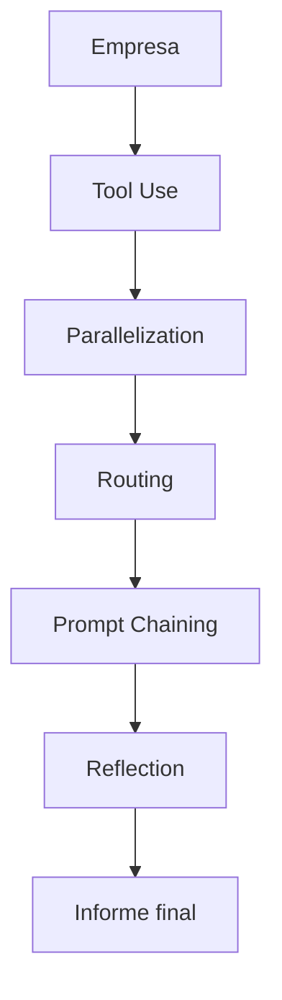

# Financial Agent — Patrones de Agentes en Acción

Proyecto pedagógico que demuestra cómo integrar **Tool Use**, **Parallelization**, **Routing**, **Prompt Chaining** y **Reflection** en un sistema coherente utilizando un modelo local.

El objetivo no es construir un analista financiero real.
El objetivo es mostrar cómo múltiples patrones de agentes pueden componerse de forma limpia, modular y mantenible.

---

## Por qué existe este proyecto

La mayoría de ejemplos sobre agentes muestran patrones aislados:

* Un ejemplo de Tool Use,
* Un loop de Reflection,
* Un router simple,
* Una cadena de prompts.

El problema aparece cuando intentas integrarlos en un único sistema:
los patrones empiezan a solaparse, el estado se dispersa y el código se vuelve difícil de mantener.

Este proyecto demuestra una arquitectura mínima donde cada patrón tiene:

* Una responsabilidad clara,
* Un punto de entrada definido,
* Y un punto de salida predecible.

La idea principal es que puedas abrir cualquier archivo del proyecto y señalar exactamente dónde ocurre cada patrón.

---

## Arquitectura



### Flujo general

1. **Tool Use** → obtener datos externos.
2. **Parallelization** → ejecutar herramientas concurrentemente.
3. **Routing** → clasificar la empresa según métricas.
4. **Prompt Chaining** → generar el informe paso a paso.
5. **Reflection** → revisar y corregir el resultado final.

---

## Estructura del proyecto

```text
financial_agent/
├── main.py          # Orquestador principal
├── models.py        # Contexto central compartido
├── tools.py         # Herramientas de datos (Tool Use)
├── routing.py       # Clasificación de empresa (Routing)
├── chaining.py      # Generación paso a paso (Prompt Chaining)
├── reflection.py    # Revisión y corrección (Reflection)
├── prompts.py       # Templates de prompts
├── reports/         # Informes generados
└── examples/        # Ejemplos de salida
```

---

## Patrones implementados

## 1. Tool Use (`tools.py`)

Tres herramientas independientes:

* `get_financials()` → ingresos, crecimiento, margen, EPS.
* `get_balance()` → efectivo, deuda, activos, pasivos.
* `get_news()` → noticias recientes.

Cada herramienta representa una fuente de datos independiente.

---

## 2. Parallelization (`main.py` → `fetch_data()`)

Las herramientas se ejecutan concurrentemente usando `asyncio.gather()`.

```python
financials, balance, news = await asyncio.gather(
    asyncio.to_thread(get_financials, ctx.company),
    asyncio.to_thread(get_balance, ctx.company),
    asyncio.to_thread(get_news, ctx.company),
)
```

La latencia total queda limitada por la herramienta más lenta, no por la suma de todas.

---

## 3. Routing (`routing.py`)

Router determinista basado en métricas financieras:

* **Growth** → `revenue_growth > 20%`
* **Risk** → `debt_ratio > 0.6`
* **Stable** → resto de casos

El tipo de empresa modifica posteriormente los prompts usados durante la generación.

---

## 4. Prompt Chaining (`chaining.py`)

El informe se genera en cuatro pasos secuenciales:

1. Resumen ejecutivo
2. Análisis de riesgos
3. Perspectivas
4. Informe completo

Cada etapa utiliza el output de la anterior como contexto.

Esto reduce complejidad por prompt y mejora consistencia.

---

## 5. Reflection (`reflection.py`)

Loop Generator-Critic:

1. El Generator produce un draft.
2. El Critic revisa:

   * coherencia financiera,
   * riesgos omitidos,
   * contradicciones,
   * afirmaciones sin soporte.
3. Si hay problemas, el Generator corrige.
4. Máximo 3 iteraciones.

La revisión usa temperatura baja (`0.1`) para maximizar consistencia.

---

## Contexto central compartido

Todos los patrones leen y escriben sobre el mismo objeto:

```python
AnalysisContext
```

Esto evita pasar múltiples variables entre módulos y mantiene el flujo visible.

### Ventaja

* Menos acoplamiento accidental.
* Flujo más fácil de seguir.
* Código más legible.

### Tradeoff

El estado es mutable.

En este proyecto el riesgo es aceptable porque:

* el flujo es secuencial,
* y cada patrón escribe en campos distintos.

En sistemas más complejos podría sustituirse por:

* eventos,
* estado inmutable,
* o colas de mensajes.

---

## Decisiones de diseño

### Routing determinista

El router usa reglas explícitas en lugar de un LLM.

Razones:

* comportamiento reproducible,
* menor latencia,
* menor coste,
* categorías simples y claras.

Cuando las reglas son evidentes, un modelo añade complejidad innecesaria.

---

### Reflection limitada a 3 iteraciones

Después de la tercera iteración la mejora marginal cae rápidamente mientras el coste crece linealmente.

Más iteraciones no significan necesariamente mejor calidad.

---

### Herramientas sincrónicas ejecutadas con `to_thread()`

Las herramientas son funciones Python normales.

`asyncio.to_thread()` permite ejecutarlas concurrentemente sin reescribirlas como `async`.

Esto simplifica el ejemplo y mantiene el foco en los patrones.

---

## Ejemplo de uso

```python
import asyncio
from financial_agent.main import analyze_company

async def main():
    report = await analyze_company("NVIDIA")
    print(report)

asyncio.run(main())
```

---

## Ejemplo de output

```text
Empresa: NVIDIA
Clasificación: Growth
Iteraciones de Reflection: 3

Resumen Ejecutivo:
NVIDIA demuestra un desempeño financiero extraordinario,
impulsado por un crecimiento explosivo de ingresos del 94%
y una sólida generación de beneficios netos de $29.7 mil millones.

La compañía mantiene márgenes brutos del 72%,
reflejando un fuerte poder de fijación de precios
dentro del ecosistema de IA.

Riesgos identificados:
- Dependencia de TSMC como cuello de botella operativo.
- Presión competitiva de AMD en el segmento enterprise.
- Restricciones regulatorias sobre exportaciones a China.
- Riesgo de valoración debido a expectativas extremadamente altas.

Perspectivas:
La sostenibilidad del crecimiento dependerá de la transición
exitosa a Blackwell y de la capacidad de NVIDIA para consolidar
su ecosistema de software y servicios alrededor de CUDA.
```

Fragmento generado por el pipeline completo:

* Tool Use → obtención de datos,
* Routing → clasificación "growth",
* Prompt Chaining → generación por etapas,
* Reflection → revisión y corrección iterativa.

---

## Configuración

El proyecto utiliza un modelo local vía API OpenAI-compatible.

Configuración actual:

* Modelo: `gemma-3-12b`
* Endpoint: `http://10.0.1.5:1234/v1`

La configuración puede modificarse directamente en `chaining.py`.

Compatible con:

* LM Studio,
* Ollama,
* vLLM,
* Text Generation WebUI,
* cualquier endpoint OpenAI-compatible.

---

## Lo que este proyecto NO incluye

Para mantener el foco en la arquitectura, el proyecto omite deliberadamente:

* autenticación,
* retries avanzados,
* observabilidad,
* persistencia,
* validación avanzada,
* caché,
* rate limiting,
* datos financieros reales,
* optimización avanzada de prompts.

El objetivo es enseñar composición de patrones, no construir un sistema enterprise.

---

## Lo importante no es el análisis financiero

El dominio financiero es solo un vehículo pedagógico.

La misma arquitectura podría reutilizarse para:

* análisis legal,
* auditoría de código,
* investigación científica,
* análisis documental,
* revisión de contratos,
* inteligencia competitiva.

Cambiando herramientas y prompts, la estructura permanece prácticamente igual.

---

## Objetivo del proyecto

Este proyecto intenta demostrar una idea simple:

> La complejidad de los agentes no está en los patrones individuales.
> Está en integrarlos sin que se solapen.

Cuando cada patrón tiene:

* una responsabilidad clara,
* entradas definidas,
* y salidas predecibles,

el sistema sigue siendo entendible incluso combinando múltiples componentes.

---

## Licencia

MIT
